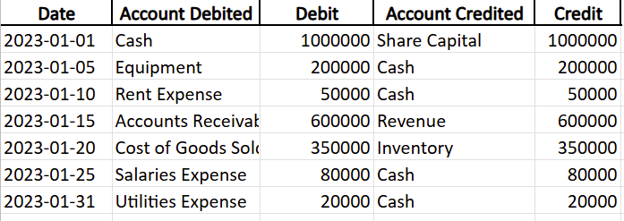
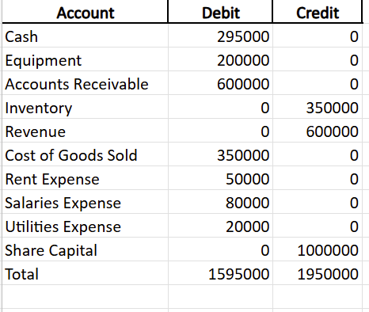

# ArCa Financial Statement Analysis & Bookkeeping Demo (2021–2023)

## Goal

This project demonstrates **practical Accounting and Data Science** using real financial data from **Armenian Card CJSC (ArCa)** for the years **2021–2023**.

It includes:
- Analysis of real Balance Sheet, Income Statement, and Cash Flow data.
- Calculation of key financial ratios: **Revenue Growth, Expenses Growth, Profit Margin, Debt-to-Equity, Current Ratio**.
- Clean Python code for data extraction, processing, and visualization.
- A simple **bookkeeping example**: Journal Entries and Trial Balance

---

## Project Structure

```
arca_case_study/
├── data/               # Raw CSV files (real financial statements)
├── analysis.py         # Python script: cleaning, ratios, plots
├── output/             # Processed CSVs and saved charts
├── accounting_example.xlsx  # Bookkeeping tabs: Journal, T-Accounts, Trial Balance
├── screenshots/        # Screenshots of bookkeeping work
├── README.md           # This file
├── report.md           # Short summary report
```

---

## 🧾 Accounting Bookkeeping Demo

To connect accounting principles to the statements:
- **Journal Entries**: 7 realistic transactions, balanced.
- **T-Accounts**: shows postings to each major account.
- **Trial Balance**: verifies double-entry accuracy.

**Screenshots:**

| Journal Entries | Trial Balance |
|-----------------|----------------|
|  |  |

---

## Key Findings

**Revenue** grew ~10% per year (2021–2023).  
**Profit Margin** improved from ~20% to ~35%.  
**Debt-to-Equity** decreased, showing improved solvency.  
**Current Ratio** increased, indicating strong liquidity.

---

## How to Run

1️. Clone the repo  
2️. Install requirements (optional, just uses pandas & matplotlib)  
3️. Run the analysis:
```bash
python analysis.py
```

---

## Report

See `report.md` for a short written summary of trends and insights.

---
## Tech Stack & Requirements

- **Python:** 3.x
- **pandas:** 1.5 or higher
- **matplotlib:** 3.7 or higher
- **fpdf:** for PDF report generation

Install dependencies:
```bash
pip install pandas matplotlib fpdf


## Notes

- **Journal Entries** are an educational sample designed to match the scale of the real statements.
- All ratio analysis is based on the **actual published financials of ArCa CJSC**.

---

## Author

*Anna Davoyan*

